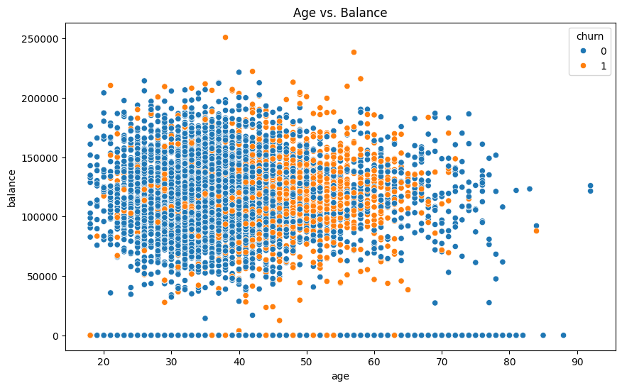
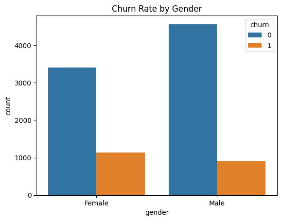
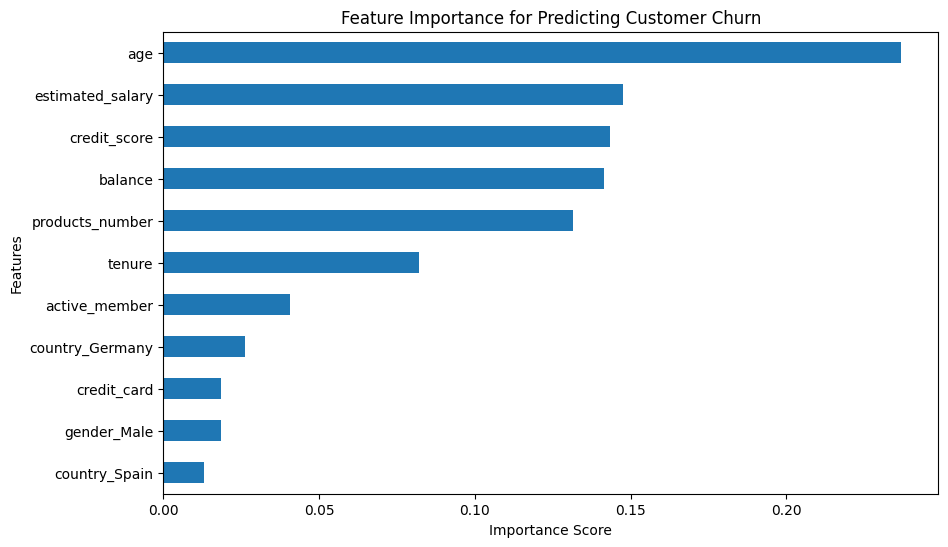

# Bank Customer Churn Analysis

This project explores a bank’s customer dataset to analyze patterns in customer churn. The goal is to uncover which customers are most likely to leave and why, using data analysis and visualizations.

## ❗ Problem Statement

Customer retention is a critical concern for banks, as losing valuable clients can lead to significant revenue loss. Understanding the underlying factors driving customer churn is essential for designing effective retention strategies. This project investigates the behavioral and demographic patterns of customers who are more likely to leave the bank.

## 📌 Objective

Identify key factors that influence customer churn and provide data-driven recommendations to help a bank retain valuable clients.

## 📂️ Dataset

The dataset contains the following attributes:

- Demographics: Gender, Age, Geography
- Account info: Credit Score, Balance, Tenure, Number of Products
- Status: Active status, Churn (Exited), etc

## 🧰 Tools & Libraries

- Python
- Pandas
- Matplotlib
- Seaborn
- Jupyter Notebook
- numpy
- scipy.stats
- sklearn.ensemble
- sklearn.model_selection

## 📊 Key Findings

- Most customers have a credit score between 600 and 700.
- The churn rate is higher among female customers than male.
- Customers aged between 50 and 60 show a higher churn rate.
- Customers with high bank account balances are more likely to churn.
- There is a significant relationship between gender and churn, with females being more likely to leave the bank.
- There is also a significant difference in average credit scores between churned and non-churned customers.

## 🧠 Business Recommendations

- A higher churn rate among older customers may indicate vulnerability to online scams or financial exploitation, which could lead to distrust in banking services.
- The higher churn rate among female customers suggests the need to review the customer journey by gender. This includes evaluating whether certain touchpoints (e.g., onboarding, complaints handling, service delivery) are less satisfactory for women. Interviews or surveys could provide deeper insights into why they churn more often.
- Implement churn prediction models to proactively identify customers at risk.
- If churned customers tend to have lower credit scores, introduce financial support programs—such as credit counseling, financial literacy tools, or personalized recommendations—to help them improve their creditworthiness and remain engaged with the bank.

## ▶️ How to Run

1. Download the notebook
2. Install requirements (`pandas`, `matplotlib`, `seaborn`, etc)
3. Run all cells in order

## 📌 Sample Visuals

### Age vs Balance  

### Churn Rate by Gender  

### Feature Importance from Random Forest  

## 👤 About Me

**Kudzai Chihuri**\
Aspiring Data Analyst | Background in Banking & Economics | Based in New Zealand\
[LinkedIn Profile](https://www.linkedin.com/in/kudzai-chihuri) | [Email](mail to:kupakwashemanhanga@gmail.com)  

